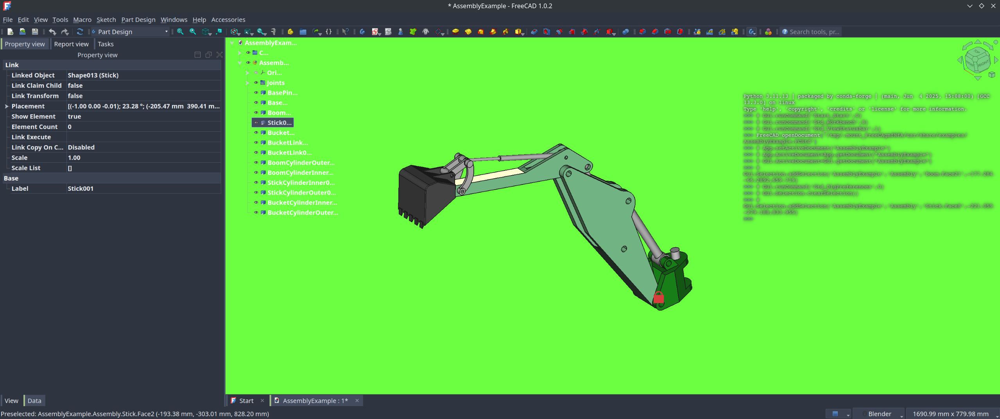
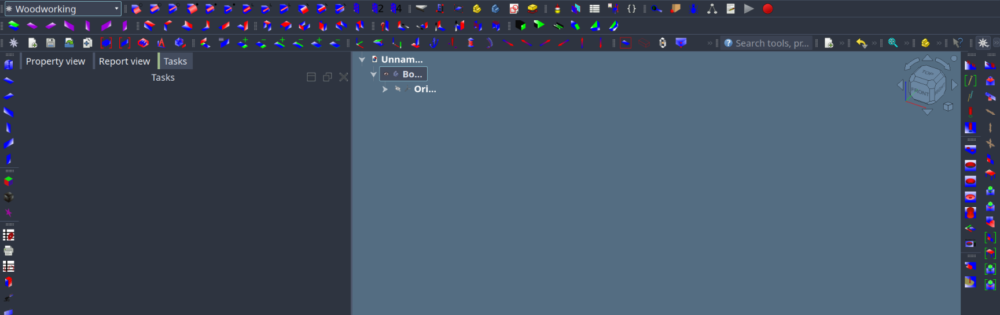

<table align = 'left' >
<tr>
<td>

[« Overview][Page-Overview]

</td>
</tr>
</table>

<table align = 'right' >
<tr>
<td>

[How to **Structure** your addon. »][Page-Structure]

</td>
</tr>
</table>

 
 

# 1. Addon

What's an addon and why do I suddenly want to ~~waste~~  
spend my time creating and **maintaining** it for eternity  
or at least until I get bored of it?

Well, they allow you to mess with FreeCAD in whatever way  
you can imagine as long as you can code it or if you are of  
the practical sort, help you improve your workflow's synergy.

 

## 🦀 Possibilities

Here are few of the things you can do with addons.

-   Create a **Preference Pack** to show everyone  
    how FreeCAD should have actually looked like.

    

     

-   Add additional tools into existing workbenches  
    so you can finally have a button that randomly  
    colors parts, oh wait that already exists.  

    

-   You can create support for **importing** / **exporting**  
    cursed file formats to give people a real scare.

-   If you can convince your superiors you might be   
    able to spend the rest of your life working on a   
    **custom workbench** that does so much it might  
    as well be a standalone program.

    

 

## 🧯 Interface

You might wonder how they work and that is a great  
question we will not cover here, at least not in detail.

All you need or want to know is that you can write an  
addon with Python - technically C++ but don't ask me  
me how - and it makes FreeCAD do your bidding.

That is, as long as the API supports it. Sorry to break  
it to you but some things just aren't exposed in Python.

You can of course submit a PR to FreeCAD core and fix   
it if that happens, but you will likely just work around it.

 

## 🐍 Python

If you choose the sane way of interfacing through Python  
you will want to have typing support for FreeCAD's API.

Lucky for you, some people outside FreeCAD thought of  
that and created a neat PyPi stubs [Package] that covers at  
least some of the API.

Why 'some of the API', that's a long story, but let's just say  
4 different mixes of type declarations in FreeCAD & regexes.

Some work is being done to improve this, but that will  
likely take a Short While™ until it's in a usable state.

 

Work in progress,  
To be continued ..

 

[Page-Structure]: ./Structure.md
[Page-Overview]: ..

[Package]: https://pypi.org/project/freecad-stubs